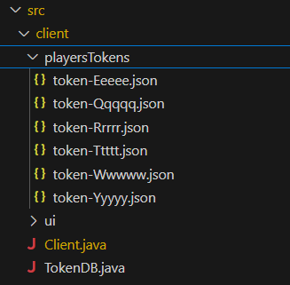

# T01G12 - 2nd CPD Project

## Compile & Run Instructions

### Makefile Commands:

The Makefile contains the following commands to **compile and run the project**:

This project is available in **Java SE version 21** or later.

To use this project, you'll need to compile the server and client, and then you can run them. The Makefile provides convenient commands to handle these tasks.

To compile the server, use the command:
````
make compile-server
````

This command will compile the server source file located in **server/network/GameServer.java.**

To compile the client, use the command:
````
make compile-client
````

This command will compile the client source file located in ****client/Client.java.**

To compile both Client and Server in just one command:
````
make all
````

After compiling, you can **start the game server** by executing:
````
make run-server
````
To **start a game client**, open a terminal and use the command:
````
make run-client
````

To handle JSON objects, we use the `json-20240303.jar` library. Make sure this JAR file is placed in the `lib` directory.

### Compiling the JSON Library:

To compile the JSON library, run the following command:
```bash
javac -cp ".:./lib/json-20240303.jar:src" -d ./bin lib/json-20240303.jar
```


The Makefile ensures that this process is automated, making it easier for users to compile and run the project without additional steps.


### For further commands, check the Makefile code:

```bash
# Detect OS
ifeq ($(OS),Windows_NT)
    detected_OS := Windows
    RM = del /s /q
    CP_SEP = ;
else
    detected_OS := $(shell uname)
    RM = rm -rf
    CP_SEP = :
endif

JAVAC=javac
JAVA=java
BIN_DIR=../bin
LIB_DIR=../lib
JSON_JAR=$(LIB_DIR)/json-20240303.jar
MAIN_SERVER_PACKAGE=server/network
MAIN_SERVER_CLASS=GameServer
MAIN_CLIENT_PACKAGE=client
MAIN_CLIENT_CLASS=Client

.PHONY: all compile-server compile-client run-server run-client clean help

all: compile-server compile-client

compile-server:
	$(JAVAC) -cp ".${CP_SEP}$(JSON_JAR)${CP_SEP}src" -d $(BIN_DIR) $(MAIN_SERVER_PACKAGE)/$(MAIN_SERVER_CLASS).java

compile-client:
	$(JAVAC) -cp ".${CP_SEP}$(JSON_JAR)${CP_SEP}src" -d $(BIN_DIR) $(MAIN_CLIENT_PACKAGE)/$(MAIN_CLIENT_CLASS).java


run-server:
	$(JAVA) -cp "$(BIN_DIR)$(CP_SEP)$(JSON_JAR)$(CP_SEP)src" server.network.GameServer

run-client:
	$(JAVA) -cp "$(BIN_DIR)$(CP_SEP)$(JSON_JAR)$(CP_SEP)src" client.Client


# Clean command using the correct RM command
clean:
	$(RM) $(BIN_DIR)/*
	$(RM) *.class


help:
	@echo "Usage: make [command]"
	@echo "Available commands:"
	@echo "  all             Compile all source files"
	@echo "  compile-server  Compile the project's server"
	@echo "  compile-client  Compile the project's client"
	@echo "  run-server      Start the game server"
	@echo "  run-client      Start a game client"
	@echo "  clean           Remove compiled class files"
	@echo "  help            Display this help message"

```


## Database

The database used by the server **Database.java** has the following format:
````json
{"users": [
 {
  "sessionExpiry": 1715777163200,
  "lastActiveTime": 1715776563200,
  "rank": 1121,
  "isLoggedIn": true,
  "passwordHash": "ZXeVjjv2oq6kCzl6BcPS5wSWRcEiMuZ80I4+lcbPF24=",
  "username": "cristiano1",
  "token": "9edb4c09-c12c-4c9d-ad17-06dc94e2aeed"
 },
````

User passwords in the database are stored using a **hashing mechanism**. The passwordHash field contains the hashed version of the user's password. 

The token field contains a unique token that is **generated upon successful authentication** and used to verify the user's identity for subsequent requests.

The user's username and ELO points from ranked mode are also **stored in the database**, as well as the last time they were active and if they are logged in.

## Tokens

The clients tokens database used by the client **Client.java** has the following format:
````json
{
  "state": "none",
  "token": "a3133dba-6fda-43f7-a2b1-a6ed3cd05535"
}
````



Each user has a **JSON file** containing their session token and state. The token field stores a unique token generated upon successful authentication, used to verify the user's identity for subsequent requests. The **state** field can be one of the following: **none**, **lobby**, or **game**. This indicates the user's current state, which helps manage reconnections and game continuity.

## Authentication

After compiling and running the project, four different options appear on screen:


1. **Login (Access Your Existing Account)**

   In the first case, the user is asked to enter their username and password. Upon **successful authentication**, the user is logged in and can proceed to play the game.

2. **Login with Token (Access Your Existing Account)**

   In the second case, the user is only asked to enter their username. The system will **use the stored token to authenticate** the user and will redirect them to the game they were playing if it is still ongoing.

3. **Register (Create a New Account)**

   In the third case, the user is asked to register a new account by providing a username and password. For the password to be valid, it must have **at least 8 characters, one uppercase letter, one lowercase letter, and one digit**. If the user does not provide a valid password, they are prompted to try again.

4. **Quit (Close Game)**

   In the fourth case, the user quits the game, and the connection to the server is closed.


### After Logging In:

After logging in, three different options appear:


1. **Play (Simple - Join a game with others)**

   In this mode, players join a game without any ranking system involved. The first `n` users that connect are assigned to the first game instance, and the next batch of `n` users will form the next game, and so on. The **lobby reconnection feature** ensures that if a player disconnects, they can **rejoin the lobby** in the same queue position they were before disconnection, provided they reconnect within a certain timeframe.

2. **Play (Ranked Lobby - Compete for the high score)**

   In this mode, players compete in a ranked match. The system uses an **ELO-based ranking system** to match players with similar skill levels. The matchmaking algorithm tries to create balanced teams based on player rankings. After each match, the ELO of the players is updated according to their performance. Note that in ranked mode, the lobby reconnection feature **prioritizes the rank over the waiting time**, so disconnected players might lose their position in the queue.

3. **Logout (Close Game)**

   This option allows the user to **log out and end their session**. The user's token and state are reset, and the connection to the server is closed. The user is taken back to the main menu or exits the game client.


## Implemented Game
For this project, we implemented a **simple text-based game** called Guessing Game. The purpose of this game is to find the number that is previously generated between a certain range. The user has infinite tries until they get the number right. The game will tell if the number they are guessing is **higher** or **lower** than the user's input. The game ends when one of the players in the lobby guesses the number correctly.


**Joining the Game:**
- Upon logging in, select the desired game mode (Simple or Ranked) from the menu.
- You will be placed in a lobby, waiting for other players to join.

   

   


**Starting the Game:**
- Once the required number of players join the lobby, the game starts automatically by the minimum required number of players in **simple mode** or by ranking ELO matching matchmaking to make the **ranked game** competitive.
- A random number within a specified range is generated by the server.

   


**Guessing the Number:**
- Each player takes turns **guessing the number**.
- After each guess, the server responds with whether the guessed number is higher or lower than the actual number.

**Winning the Game:**
- The game continues until one of the players correctly **guesses the number**.
- The player who guesses the number correctly wins the game.

   


## Matchmaking

**Simple Mode:**
- Players play an **unranked match**.
- The lobby reconnection feature ensures players can rejoin the lobby and retain their position if they **disconnect temporarily**.

**Ranked Mode:**
- Players compete in a ranked match with an ELO-based ranking system.
- Each player's ELO is updated according to their performance in the match.
- Players start with 1000 ELO points and **gain or lose points** based on the official **ELO formula**.
- The lobby reconnection feature **prioritizes rank over waiting time**, meaning disconnected players may lose their position in the queue.

   

   

## Client-Server Messages

The communication between the **client and server** is facilitated through a set of predefined messages defined in `Commands.java`. These messages ensure a standardized protocol for all interactions, covering various aspects such as user authentication, game actions, and lobby management.

```java
   public class Commands {
      public static final String REGISTER = "REGISTER";
      public static final String REGISTER_SUCCESS = "REGISTER_SUCCESS";
      public static final String LOGIN = "LOGIN";
      public static final String LOGIN_WITH_TOKEN = "LOGIN_WITH_TOKEN";
      public static final String START_GAME_SIMPLE = "START_GAME_SIMPLE";
      public static final String START_GAME_RANK = "START_GAME_RANK";
      public static final String GUESS = "GUESS";
      public static final String GAME_STATE = "GAME_STATE";
      public static final String LOGOUT = "LOGOUT";
      public static final String QUIT_GAME = "QUIT_GAME";
      public static final String QUIT_LOBBY = "QUIT_LOBBY";
      public static final String ASK_RANK = "ASK_RANK";
      public static final String LOGIN_SUCCESS = "LOGIN_SUCCESS";
      public static final String GUESS_INCORRECT = "GUESS_INCORRECT";
      public static final String GUESS_CORRECT = "GUESS_CORRECT";
      public static final String GAME_OVER = "GAME_OVER";
      public static final String ERROR = "ERROR";
      public static final String INVALID_SESSION = "INVALID_SESSION";
      public static final String GAME_STARTING = "GAME_STARTING";
      public static final String WAITING_QUEUE = "WAITING_QUEUE";
      public static final String RECONNECT = "RECONNECT";
      public static final String RECONNECT_LOBBY = "RECONNECT_LOBBY";
      public static final String RECONNECT_SUCCESS = "RECONNECT_SUCCESS";
      public static final String RECONNECT_FAILED = "RECONNECT_FAILED";
      public static final String PLAYER_RECONNECT = "PLAYER_RECONNECT";
      public static final String PLAYER_DISCONNECTED = "PLAYER_DISCONNECTED";
      public static final String PLAYER_QUITED = "PLAYER_QUITED";
      public static final String ASK_USERNAME = "ASK_USERNAME";
   }
```

## Fault Tolerance

The system is designed to **tolerate broken connections** when users are queuing and waiting for the game to start. To handle this, the system assigns each player a unique token upon successful login or registration. This token is used to track the player's session and allow for seamless reconnection.

### Reconnection Protocol:

1. **Token Assignment:**
   - Each player is assigned a **unique token** upon login or registration.
   - The token is stored in the player's JSON file along with their current state (e.g., `none`, `lobby`, `game`).

2. **Reconnection Handling:**
   - If a player disconnects unexpectedly, they remain in the lobby or game for a designated timeout period.
   - The player can use their **token to reconnect** to the server within this timeout period.
   - Upon reconnection, the server checks the player's token and restores their **previous state** (e.g., rejoining the lobby or the game).

3. **Lobby Reconnection:**
   - In **Simple Mode**, the lobby reconnection feature ensures that players can rejoin the lobby and retain their position if they disconnect temporarily.
   - The game will not start until all required players, including those who were temporarily disconnected, have reconnected.
   - If the player does not reconnect within the timeout period, they are **removed from the lobby**, and their position is freed up for other players.

4. **Game Reconnection:**
   - Players can reconnect to the game in **both Simple and Ranked modes**.
   - The server restores the player's state and allows them to continue playing from where they left off.

## Group members T01G12

   - Alberto Serra (up202103627@uporto.pt)
   - Cristiano Rocha (up202108813@uporto.pt)
   - António Ferreira (up202108834@uporto.pt)

